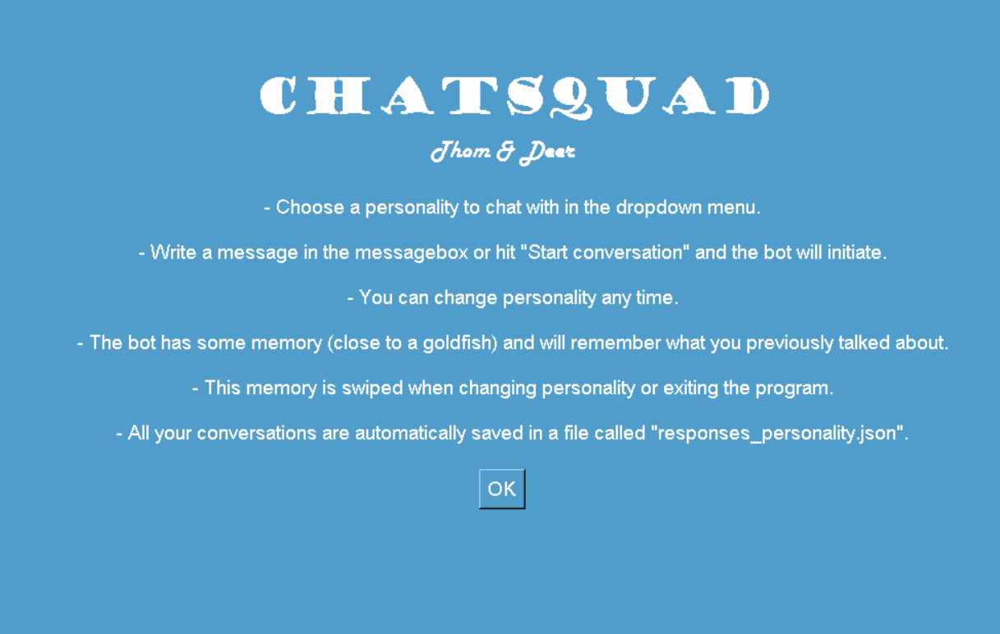
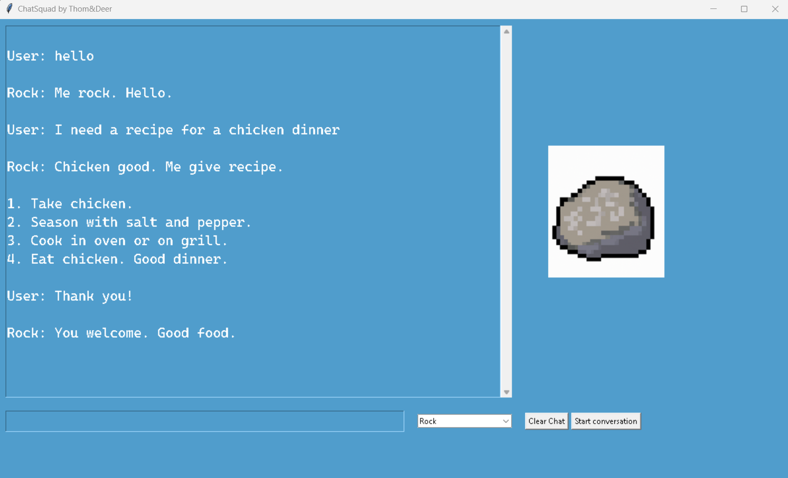
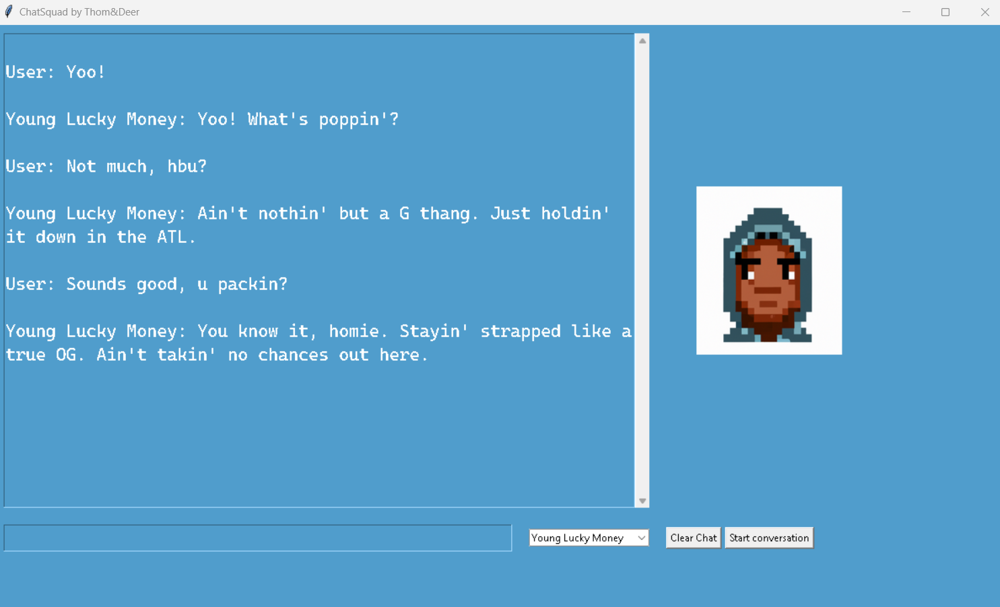

# ChatSquad

## Description
ChatSquad is a program where you can chat to different AI-based personalities inside a simple GUI.
The model has some contextual memory, and it stores all textdata as prompt;completion pairs.
This is because the model was originally used to create data for fine-tune training my own model.

## Table of Contents
1. [Installation](#Installation)
2. [Usage](#Usage)
3. [Contributor](#Contributor)
4. [License](#License)
5. [Contact Information](#Contact Information)

## Installation
Install and import the required dependencies

```python
import os

import openai

import sqlite3
```

## Usage
Ask a question and get an answer :)





## Contribution
Right now this is a solo project and contributions are not actively sought.
However, if you find a bug or have a feature suggestion, please open an issue.

**Please note that this project uses the GPT-4 Private License. You therefore need an API key to run it**

## License
This project uses the OpenAI API to generate content. Input and output from the OpenAI API is governed by the [OpenAI Terms of Use](https://openai.com/policies/terms-of-use). All other code and content within this project is under the MIT license.


## Contact information
David Thomander

[Mail](mailto:david@thomander.nu)

[LinkedIn](https://www.linkedin.com/in/david.thomander)
