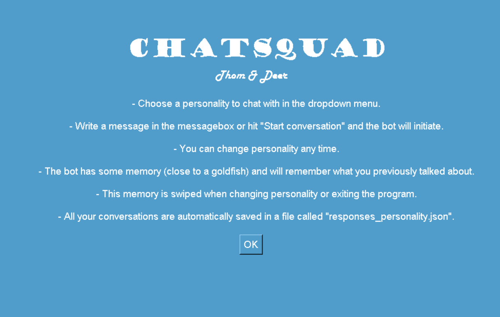
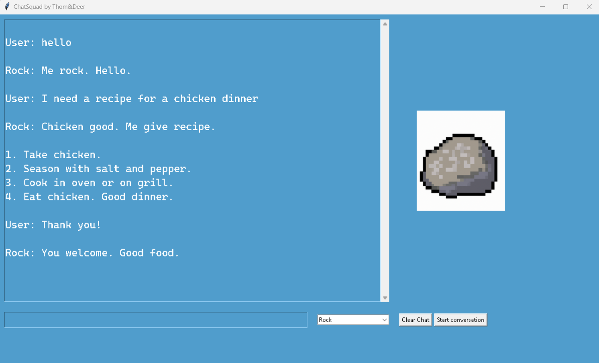
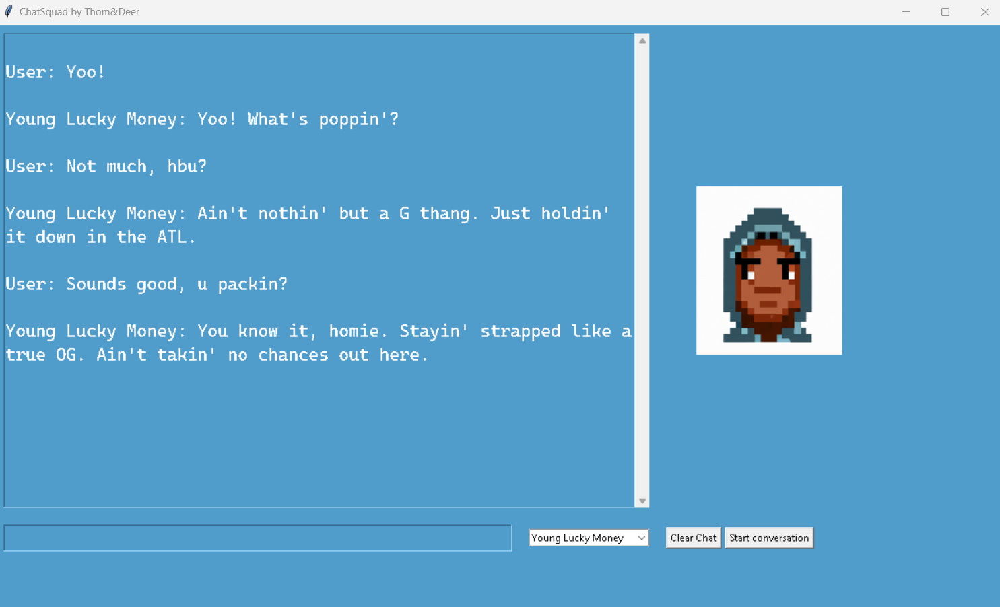

# ChatSquad

## Description
ChatSquad is a Streamlit application where you can chat with different AI-based personalities.
The model has some contextual memory and stores all text data as prompt;completion pairs.
This is because the model was originally used to create data for fine-tuning my own model.

## Table of Contents
1. [Installation](#Installation)
2. [Usage](#Usage)
3. [Contribution](#Contribution)
4. [License](#License)
5. [Contact](#Contact)

## Installation
Install the required dependencies and set your OpenAI API key.

```bash
pip install -r requirements.txt
export OPENAI_KEY="your_api_key_here"
```

## Usage
Run the Streamlit app and start chatting :)

```bash
streamlit run app.py
```





## Contribution
Right now this is a solo project and contributions are not actively sought.
However, if you find a bug or have a feature suggestion, kindly open an issue.

**Please note that this project uses the GPT-4 Private API. You therefore need an API key to run it**

## License
This project uses the OpenAI API to generate content. Input and output from the OpenAI API is governed by the [OpenAI Terms of Use](https://openai.com/policies/terms-of-use). All other code and content within this project is under the MIT license.


## Contact

David  

For any questions or concerns you may have, feel free to reach out by [mail](mailto:david@thomander.nu).


